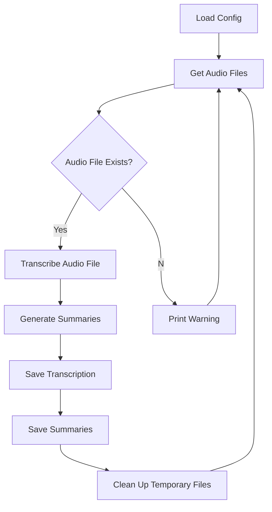

# Transcribe Me

[](https://github.com/echohello-dev/transcribe-me/actions/workflows/release.yaml)

[](https://github.com/echohello-dev/transcribe-me/actions/workflows/build.yaml)

Transcribe Me is a CLI-driven Python application that transcribes audio files using the OpenAI Whisper API and generates summaries of the transcriptions using both OpenAI's GPT-4 and Anthropic's Claude models.



## :key: Key Features

- **Audio Transcription**: Transcribes audio files using the OpenAI Whisper API. It supports both MP3 and M4A formats and can handle large files by splitting them into smaller chunks for transcription.
- **Summary Generation**: Generates summaries of the transcriptions using both OpenAI's GPT-4 and Anthropic's Claude models. The summaries are saved in Markdown format and include key points in bold and a "Next Steps" section.
- **Configurable Models**: Supports multiple models for OpenAI and Anthropic, with configurable temperature, max_tokens, and system prompts.
- **Supports Audio Files**: Supports audio files `.m4a` and `.mp3` formats.
- **Supports Docker**: Can be run in a Docker container for easy deployment and reproducibility.

## :package: Installation

Tool has been tested with Python 3.12.

### macOS

This has been tested with macOS, your mileage may vary on other operating systems like Windows, WSL or Linux.

1. Install Python. Recommended way is to use [asdf](https://asdf-vm.com/guide/getting-started.html):

    ```bash
    brew install asdf
    asdf plugin add python
    asdf install python 3.12.0
    asdf global python 3.12.0
    ```

2. Install FFmpeg using Homebrew:

   ```bash
   brew install ffmpeg
   ```

3. Install the application using pip:

    ```
    pip install transcribe-me
    ```

## :wrench: Usage

1. Bootstrap your current directory with the configuration file:

    ```bash
    transcribe-me install
    ```

    This command will also prompt you to enter your API keys for OpenAI and Anthropic if they are not already provided in environment variables. You can also set the API keys in environment variables:

    ```bash
    export OPENAI_API_KEY=your_api_key
    export ANTHROPIC_API_KEY=your_api_key
    ```

2. Place your audio files in the `input` directory (or any other directory specified in the configuration).
3. Run the application:

   ```bash
   transcribe-me
   ```

   The application will transcribe each audio file in the input directory and save the transcriptions to the output directory. It will also generate summaries of the transcriptions using the configured models and save them to the output directory.

4. (Optional) You can archive the input directory to keep track of the processed audio files:

   ```bash
   transcribe-me archive
   ```

5. (Optional) You can also transcribe only the audio files that have not been transcribed yet:

    ```bash
    transcribe-me only
    ```

### Docker

You can also run the application using Docker:

1. Install Docker on your machine by following the instructions on the [Docker website](https://docs.docker.com/get-docker/).

2. Create a `.transcribe.yaml` configuration file:

    ```bash
    touch .transcribe.yaml
    docker run \
        --rm \
        -v $(pwd)/.transcribe.yaml:/app/.transcribe.yaml \
        ghcr.io/echohello-dev/transcribe-me:latest install
    ```


3. Run the following command to run the application in Docker:

    ```bash
    docker run \
        --rm \
        -e OPENAI_API_KEY \
        -e ANTHROPIC_API_KEY \
        -v $(pwd)/archive:/app/archive \
        -v $(pwd)/input:/app/input \
        -v $(pwd)/output:/app/output \
        -v $(pwd)/.transcribe.yaml:/app/.transcribe.yaml \
        ghcr.io/echohello-dev/transcribe-me:latest
    ```

    This command mounts the `input` and `output` directories and the `.transcribe.yaml` configuration file into the Docker container.

4. (Optional) We can also run the application using the provided `docker-compose.yml` file:

    ```yaml
    version: '3'
    services:
      transcribe-me:
        image: ghcr.io/echohello-dev/transcribe-me:latest
        environment:
          - OPENAI_API_KEY
          - ANTHROPIC_API_KEY
        volumes:
          - ./input:/app/input
          - ./output:/app/output
          - ./archive:/app/archive
          - ./.transcribe.yaml:/app/.transcribe.yaml
    ```

    Run the following command to start the application using Docker Compose:

    ```bash
    docker compose run --rm transcribe-me
    ```

    This command mounts the `input`, `output`, `archive`, and `.transcribe.yaml` configuration file into the Docker container. See [`compose.example.yaml`](./compose.example.yaml) for an example configuration.

    Make sure to replace `OPENAI_API_KEY` and `ANTHROPIC_API_KEY` with your actual API keys. Also make sure to create the `.transcribe.yaml` configuration file in the same directory as the `docker-compose.yml` file.

## :rocket: How it Works

The Transcribe Me application follows a straightforward workflow:

1. **Load Configuration**: The application loads the configuration from the `.transcribe.yaml` file, which includes settings for input/output directories, models, and their configurations.
2. **Get Audio Files**: The application gets a list of audio files from the input directory specified in the configuration.
3. **Check Existing Transcriptions**: For each audio file, the application checks if there is an existing transcription file. If a transcription file exists, it skips to the next audio file.
4. **Transcribe Audio File**: If no transcription file exists, the application transcribes the audio file using the OpenAI Whisper API. It splits the audio file into smaller chunks for efficient transcription.
5. **Generate Summaries**: After transcription, the application generates summaries of the transcription using the configured models (OpenAI GPT-4 and Anthropic Claude).
6. **Save Transcription and Summaries**: The application saves the transcription to a text file and the summaries from each configured model to separate Markdown files in the output directory.
7. **Clean Up Temporary Files**: The application removes any temporary files generated during the transcription process.
8. **Repeat**: The process repeats for each audio file in the input directory.

## :gear: Configuration

The application uses a configuration file (`.transcribe.yaml`) to specify settings such as input/output directories, API keys, models, and their configurations. The configuration file is created automatically when you run the `transcribe-me install` command.

> `max_tokens` is the maximum number of tokens to generate in the summary. The default is dynamic based on the model.

Here is an example configuration file:

```yaml
openai:
  models:
    - temperature: 0.1
      max_tokens: 2048
      model: gpt-4
      system_prompt: Generate a summary with key points in bold and a Next Steps section, use Markdown, be a concise tech expert but kind to non-technical readers.

anthropic:
  models:
    - temperature: 0.8
      model: claude-3-sonnet-20240229
      system_prompt: Generate something creative and interesting, use Markdown, be a concise tech expert but kind to non-technical readers.

input_folder: input
output_folder: output
```

## Additional Make Commands

- `freeze`: Saves the installed Python package versions to the `requirements.txt` file.
- `install-cli`: Installs the application as a command-line interface (CLI) tool.

## Limitations

- The application requires API keys for both OpenAI and Anthropic. These keys are not provided with the application and must be obtained separately.
- The application is designed to run on a single machine and does not support distributed processing. As a result, the speed of transcription and summary generation is limited by the performance of the machine it is running on.
- The application does not support real-time transcription or summary generation. It processes audio files one at a time and must complete the transcription and summary generation for each file before moving on to the next one.

## :writing_hand: Contibuting

1. Clone the repository.
2. Install the required tools using ASDF (for managing tool versions) and Homebrew (for installing dependencies):

   - Install ASDF:

   ```bash
   brew install asdf
   ```

   - Install FFmpeg using Homebrew:

   ```bash
   brew install ffmpeg
   ```

3. Install the Python dependencies and create a virtual environment:

   ```bash
   make install
   ```

3. Run the `transcribe-me install` command to create the `.transcribe.yaml` configuration file and provide your API keys for OpenAI and Anthropic:

   ```bash
   make transcribe-install
   ```

4. (Optional) Install the application as a command-line interface (CLI) tool:

   ```bash
   make install-cli
   ```

### Workflows

This project uses several GitHub Actions workflows to automate various processes:

- **Build**: Triggered on pushes and pull requests to the `main` branch. It installs dependencies, runs linting, tests, and builds the project.

- **Fix Release**: Manually triggered workflow that allows fixing a specific version release. It publishes the package, Docker image, and updates the release.

- **Publish Latest Image**: Triggered on pushes to the `main` branch. It publishes the latest Docker image for multiple architectures.

- **Pull Request Release**: Triggered when a pull request is opened, reopened, or synchronized. It uses Release Drafter to draft a release based on the pull request.

- **Release**: Triggered on pushes to the `main` branch. It drafts a new release using Release Drafter, publishes the package and Docker image, and publishes the drafted release.

### Releasing a New Version

This project uses [Release Drafter](https://github.com/release-drafter/release-drafter) to automatically generate release notes and determine the version number based on the labels of merged pull requests.

To release a new version:

1. Ensure that your pull request has one of the following labels:
   - `major`: For a major version bump (e.g., 1.0.0 -> 2.0.0)
   - `minor`: For a minor version bump (e.g., 1.0.0 -> 1.1.0)
   - `patch`: For a patch version bump (e.g., 1.0.0 -> 1.0.1)

   If no label is provided, the default behavior is to bump the patch version.

2. Merge the pull request into the `main` branch.

3. The "Release" workflow will automatically trigger and perform the following steps:
   - Draft a new release using Release Drafter, determining the version number based on the merged pull request labels.
   - Publish the package to PyPI.
   - Publish the Docker image for multiple architectures.
   - Publish the drafted release on GitHub.

4. If there are any issues with the release, you can manually trigger the "Fix Release" workflow and provide the version number to fix the release.

## Star History

[](https://star-history.com/#echohello-dev/transcribe-me&Date)