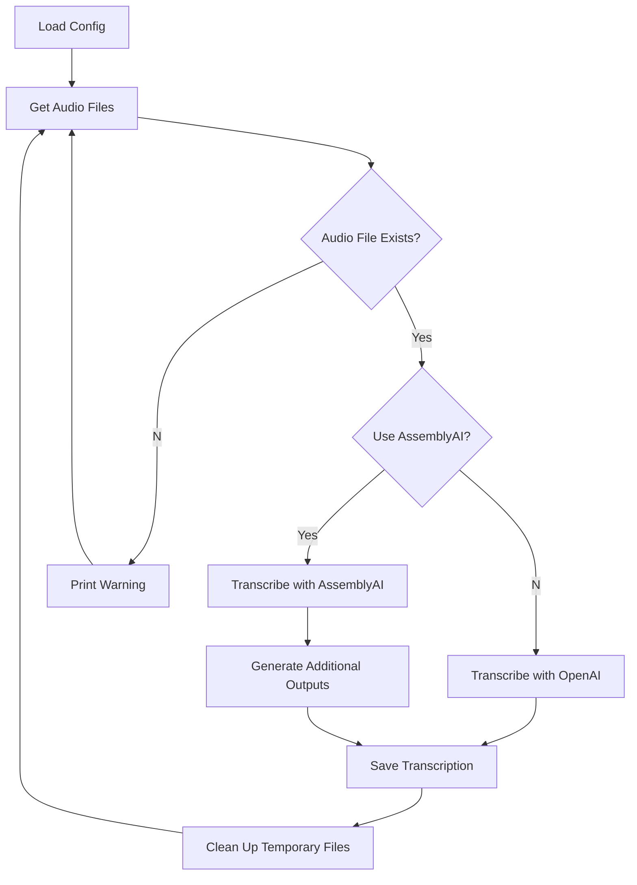

# Transcribe Me

[](https://github.com/echohello-dev/transcribe-me/actions/workflows/release.yaml)

[](https://github.com/echohello-dev/transcribe-me/actions/workflows/build.yaml)

Transcribe Me is a CLI-driven Python application that transcribes audio files using either the OpenAI Whisper API or AssemblyAI.



## :warning: Important Note

Starting from version 1.0.0, you need to explicitly install the provider(s) you want to use. The package no longer installs all providers by default to reduce unnecessary dependencies. This helps keep your environment lean by only installing what you actually need.

## :key: Key Features

- **Audio Transcription**: Transcribes audio files using either the OpenAI Whisper API or AssemblyAI. It supports both MP3 and M4A formats.
- **AssemblyAI Features**: When using AssemblyAI, provides additional outputs including Speaker Diarization, Summary, Sentiment Analysis, Key Phrases, and Topic Detection.
- **Supports Audio Files**: Supports audio files in `.m4a` and `.mp3` formats.
- **Supports Docker**: Can be run in a Docker container for easy deployment and reproducibility.

## :package: Installation

Tool has been tested with Python 3.12.

### macOS

This has been tested with macOS, your mileage may vary on other operating systems like Windows, WSL or Linux.

1. Install Python. Recommended way is to use [asdf](https://asdf-vm.com/guide/getting-started.html):

    ```bash
    brew install asdf
    asdf plugin add python
    asdf install python 3.12.0
    asdf global python 3.12.0
    ```

2. Install FFmpeg using Homebrew:

   ```bash
   brew install ffmpeg
   ```

3. Install the application using pip. You'll need to specify which provider(s) you want to use:

   - For OpenAI only:
     ```bash
     pip install "transcribe-me[openai]"
     ```
   
   - For AssemblyAI only:
     ```bash
     pip install "transcribe-me[assemblyai]"
     ```
   
   - For all providers:
     ```bash
     pip install "transcribe-me[all]"
     ```

   Or if you're installing from source:
   
   ```bash
   # Clone the repository
   git clone https://github.com/echohello-dev/transcribe-me.git
   cd transcribe-me
   
   # Install with the desired providers
   pip install -e ".[openai]"  # For OpenAI
   # or
   pip install -e ".[assemblyai]"  # For AssemblyAI
   # or
   pip install -e ".[all]"  # For all providers
   ```

## :wrench: Usage

### Basic Usage

1. Bootstrap your current directory with the configuration file:

    ```bash
    transcribe-me install
    ```

    This command will create a `.transcribe.yaml` file in your current directory and prompt you to enter your API keys for OpenAI and AssemblyAI if they are not already provided in environment variables.

2. Set up your API keys (if not already done during installation):

    ```bash
    # For OpenAI
    export OPENAI_API_KEY=your_openai_api_key
    
    # For AssemblyAI
    export ASSEMBLYAI_API_KEY=your_assemblyai_api_key
    ```

3. Place your audio files (mp3 or m4a format) in the `input` directory (or any directory specified in your configuration).

4. Run the application:

    ```bash
    transcribe-me
    ```

    The application will process each audio file in the input directory and save the transcriptions to the output directory.

5. (Optional) Archive processed files after transcription:

    ```bash
    transcribe-me archive
    ```

### Provider Selection

When running Transcribe Me, the provider used for transcription is determined by your configuration file. By default, OpenAI is used, but you can switch to AssemblyAI by setting `use_assemblyai: true` in your `.transcribe.yaml` file.

Make sure you've installed the appropriate provider package as described in the installation section. If you try to use a provider that isn't installed, you'll receive a helpful error message with instructions on how to install the missing dependency.

### Command Options

The `transcribe-me` command supports several options:

```bash
# Display help information
transcribe-me --help

# Specify a custom configuration file
transcribe-me --config /path/to/custom/config.yaml

# Run in verbose mode for detailed output
transcribe-me --verbose

# Run in debug mode for even more detailed logging
transcribe-me --debug
```

### Configuration Details

The `.transcribe.yaml` file controls the behavior of the application. Here's a comprehensive example with all available options:

```yaml
# Transcription service selection
use_assemblyai: false  # Set to true to use AssemblyAI instead of OpenAI

# Folder Configuration
input_folder: input     # Directory containing audio files to transcribe
output_folder: output   # Directory where transcriptions will be saved
archive_folder: archive # Directory for archived files (optional)

# AssemblyAI-specific options (when use_assemblyai is true)
assemblyai_options:
  speech_model: nano    # Options: base, nano, large
  speaker_labels: true  # Enable speaker diarization
  summarization: true   # Generate summary
  sentiment_analysis: true # Generate sentiment analysis
  iab_categories: true  # Generate topic detection

# OpenAI-specific options (when use_assemblyai is false)
openai_options:
  model: whisper-1      # Whisper model to use
```

### Advanced Usage

#### Processing Specific Files

Process only specific audio files:

```bash
# Transcribe a single file
transcribe-me --file path/to/your/audio.mp3

# Transcribe multiple files
transcribe-me --files file1.mp3,file2.mp3
```

#### Customizing Output Format

You can specify custom output formats in your configuration:

```yaml
output_format:
  include_timestamps: true    # Include timestamps in transcription
  include_speakers: true      # Include speaker labels (AssemblyAI only)
  text_only: false            # Output only plain text (no JSON)
```

#### Handling Large Audio Files

For large audio files, the application automatically splits them into smaller chunks for processing with OpenAI:

```yaml
splitting_options:
  chunk_size_seconds: 600     # Split files into 10-minute chunks
  overlap_seconds: 5          # 5-second overlap between chunks
```

### Docker

You can also run the application using Docker. The Docker image comes with all providers pre-installed. If you're building your own Docker image, you can choose which providers to include.

1. Install Docker on your machine by following the instructions on the [Docker website](https://docs.docker.com/get-docker/).

2. Pull the pre-built image:
   ```bash
   docker pull ghcr.io/echohello-dev/transcribe-me:latest
   ```

   Or build your own image with specific providers:
   ```dockerfile
   FROM python:3.12-slim
   
   # Install FFmpeg
   RUN apt-get update && apt-get install -y ffmpeg
   
   # Copy the application code
   COPY . /app
   WORKDIR /app
   
   # Install the package with the desired providers
   # Choose one of the following:
   RUN pip install -e ".[openai]"        # For OpenAI only
   # RUN pip install -e ".[assemblyai]"   # For AssemblyAI only
   # RUN pip install -e ".[all]"          # For all providers
   
   ENTRYPOINT ["transcribe-me"]
   ```

3. Create a `.transcribe.yaml` configuration file:

    ```bash
    touch .transcribe.yaml
    docker run \
        --rm \
        -v $(pwd)/.transcribe.yaml:/app/.transcribe.yaml \
        ghcr.io/echohello-dev/transcribe-me:latest install
    ```

3. Run the following command to run the application in Docker:

    ```bash
    docker run \
        --rm \
        -e OPENAI_API_KEY \
        -e ASSEMBLYAI_API_KEY \
        -v $(pwd)/archive:/app/archive \
        -v $(pwd)/input:/app/input \
        -v $(pwd)/output:/app/output \
        -v $(pwd)/.transcribe.yaml:/app/.transcribe.yaml \
        ghcr.io/echohello-dev/transcribe-me:latest
    ```

    This command mounts the `input` and `output` directories and the `.transcribe.yaml` configuration file into the Docker container.

4. (Optional) We can also run the application using the provided `docker-compose.yml` file:

    ```yaml
    version: '3'
    services:
      transcribe-me:
        image: ghcr.io/echohello-dev/transcribe-me:latest
        environment:
          - OPENAI_API_KEY
          - ASSEMBLYAI_API_KEY
        volumes:
          - ./input:/app/input
          - ./output:/app/output
          - ./archive:/app/archive
          - ./.transcribe.yaml:/app/.transcribe.yaml
    ```

    Run the following command to start the application using Docker Compose:

    ```bash
    docker compose run --rm transcribe-me
    ```

    This command mounts the `input`, `output`, `archive`, and `.transcribe.yaml` configuration file into the Docker container. See [`compose.example.yaml`](./compose.example.yaml) for an example configuration.

    Make sure to replace `OPENAI_API_KEY` and `ASSEMBLYAI_API_KEY` with your actual API keys. Also make sure to create the `.transcribe.yaml` configuration file in the same directory as the `docker-compose.yml` file.

## :rocket: How it Works

The Transcribe Me application follows a straightforward workflow:

1. **Load Configuration**: The application loads the configuration from the `.transcribe.yaml` file, which includes settings for input/output directories and transcription service.
2. **Get Audio Files**: The application gets a list of audio files from the input directory specified in the configuration.
3. **Check Existing Transcriptions**: For each audio file, the application checks if there is an existing transcription file. If a transcription file exists, it skips to the next audio file.
4. **Transcribe Audio File**: If no transcription file exists, the application transcribes the audio file using either the OpenAI Whisper API or AssemblyAI, based on the configuration.
5. **Generate Outputs**:
   - For OpenAI: The application generates summaries of the transcription using the configured models (OpenAI GPT-4 and Anthropic Claude).
   - For AssemblyAI: The application generates additional outputs including Speaker Diarization, Summary, Sentiment Analysis, Key Phrases, and Topic Detection.
6. **Save Transcription and Outputs**: The application saves the transcription and all generated outputs to separate files in the output directory.
7. **Clean Up Temporary Files**: The application removes any temporary files generated during the transcription process.
8. **Repeat**: The process repeats for each audio file in the input directory.

## :gear: Configuration

The application uses a configuration file (`.transcribe.yaml`) to specify settings such as input/output directories, API keys, models, and their configurations. The configuration file is created automatically when you run the `transcribe-me install` command.

Here is an example configuration file:

```yaml
use_assemblyai: false  # Set to true to use AssemblyAI instead of OpenAI for transcription

input_folder: input
output_folder: output
```

## Additional Make Commands

- `freeze`: Saves the installed Python package versions to the `requirements.txt` file.
- `install-cli`: Installs the application as a command-line interface (CLI) tool.

## Limitations

- The application requires API keys for both OpenAI and Anthropic. These keys are not provided with the application and must be obtained separately.
- The application is designed to run on a single machine and does not support distributed processing. As a result, the speed of transcription and summary generation is limited by the performance of the machine it is running on.
- The application does not support real-time transcription or summary generation. It processes audio files one at a time and must complete the transcription and summary generation for each file before moving on to the next one.

## :writing_hand: Contibuting

1. Clone the repository.
2. Install the required tools using ASDF (for managing tool versions) and Homebrew (for installing dependencies):

   - Install ASDF:

   ```bash
   brew install asdf
   ```

   - Install FFmpeg using Homebrew:

   ```bash
   brew install ffmpeg
   ```

3. Install the package with pip. You can choose which providers to install:

   - For OpenAI only:
     ```bash
     pip install -e ".[openai]"
     ```
   
   - For AssemblyAI only:
     ```bash
     pip install -e ".[assemblyai]"
     ```
   
   - For all providers:
     ```bash
     pip install -e ".[all]"
     ```

   Or using uvx:
   
   - For OpenAI only:
     ```bash
     uvx install -e ".[openai]"
     ```
   
   - For AssemblyAI only:
     ```bash
     uvx install -e ".[assemblyai]"
     ```
   
   - For all providers:
     ```bash
     uvx install -e ".[all]"
     ```

3. Install the Python dependencies and create a virtual environment:

   ```bash
   make install
   ```

3. Run the `transcribe-me install` command to create the `.transcribe.yaml` configuration file and provide your API keys for OpenAI and AssemblyAI:

   ```bash
   make transcribe-install
   ```

4. (Optional) Install the application as a command-line interface (CLI) tool:

   ```bash
   make install-cli
   ```

## Star History

[](https://star-history.com/#echohello-dev/transcribe-me&Date)
